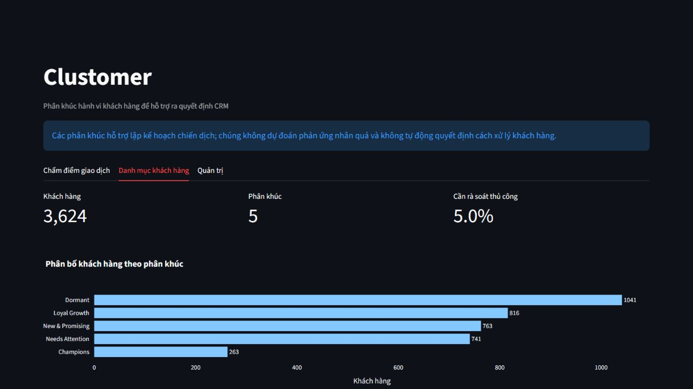
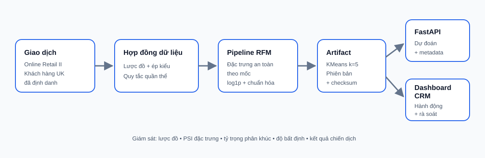

# Clustomer

> Phân khúc hành vi khách hàng để hỗ trợ ra quyết định CRM

[](https://www.python.org/)
[](https://scikit-learn.org/)
[](https://fastapi.tiangolo.com/)
[](#chat-luong-va-kha-nang-tai-lap)

Clustomer phân nhóm các khách hàng đã định danh tại Vương quốc Anh theo hành vi Recency, Frequency và Monetary để đội ngũ CRM lập kế hoạch giữ chân, phát triển giá trị và tái kích hoạt khách hàng. Hệ thống không tự động chọn ưu đãi và không ước lượng tác động nhân quả của chiến dịch.





## Dữ liệu có thể hỗ trợ những gì

- Nguồn dữ liệu: bản trích xuất Online Retail II đã lưu trong kho mã nguồn, từ **1 tháng 12 năm 2009 đến 9 tháng 12 năm 2010**.
- Đơn vị dữ liệu gốc: 525.461 dòng hàng hóa trên hóa đơn, không phải từng khách hàng.
- Quần thể triển khai: khách hàng đã định danh tại Vương quốc Anh, sau khi loại dòng trùng hoàn toàn và chỉ giữ giao dịch mua hoàn tất có số lượng, đơn giá dương.
- Quần thể sạch: 364.233 dòng hàng hóa và 3.969 khách hàng.
- Sai lệch chọn mẫu quan trọng: 20,54% dòng gốc thiếu `Customer ID`, tương ứng 14,30% doanh thu dương đại diện; không thể phân khúc đáng tin cậy các dòng này.

Mô hình dùng lịch sử đến hết ngày 31 tháng 8 năm 2010 để phát triển; tháng 9–10 để xác thực. Sau khi khóa thiết kế, mô hình được huấn luyện lại đến hết ngày 31 tháng 10 và chỉ mở tập kiểm định cuối từ ngày 1 tháng 11 đến 9 tháng 12 đúng một lần.

## Kết quả

Thiết kế được khóa là KMeans với năm phân khúc trên các đặc trưng RFM đã biến đổi `log1p` và chuẩn hóa.

| Chỉ số | Phát triển / xác thực | Tập kiểm định cuối |
|---|---:|---:|
| Silhouette | 0,329 | 0,337 |
| Davies–Bouldin | 0,984 | 0,967 |
| Tỷ trọng phân khúc nhỏ nhất | 7,67% | 7,26% |
| Mức phân tách doanh thu tương lai (η²) | 0,212 | 0,200 |
| Mức phân tách hoạt động tương lai (η²) | 0,162 | 0,147 |
| Độ ổn định giữa các seed (ARI) | 0,978 | — |

Đường cơ sở RFM theo quy tắc đạt η² doanh thu tương lai 0,186 trên giai đoạn xác thực. Mô hình được chọn bao phủ 100% khách hàng đủ điều kiện, cải thiện khả năng phân tách hành vi tương lai và vẫn giữ quy mô phân khúc đủ để hành động. Đây là khác biệt mang tính mô tả và dự đoán, không phải bằng chứng một chiến dịch sẽ tạo ra mức tăng doanh thu.

Tên phân khúc được giữ theo quy ước đã duyệt: **Champions**, **Loyal Growth**, **New & Promising**, **Needs Attention** và **Dormant**. 5% lượt gán có độ bất định cao nhất được đánh dấu để rà soát thủ công.

## Quy trình khoa học dữ liệu

Chạy notebook theo thứ tự; mỗi notebook đã được lưu cùng kết quả thực tế:

1. `01_EDA.ipynb` — kiểm tra nguồn gốc, chất lượng, quần thể, giao dịch hoàn trả và sai lệch chọn mẫu.
2. `02_Feature_Engineering.ipynb` — tạo đặc trưng an toàn theo mốc thời gian, xử lý ý nghĩa giá trị thiếu và chia dữ liệu theo thời gian.
3. `03_Model_Experiments.ipynb` — so sánh đường cơ sở kinh doanh, bốn họ mô hình, độ ổn định và lựa chọn có ràng buộc.
4. `04_Model_Interpretation.ipynb` — lập hồ sơ, diễn giải tổng thể/cục bộ, kiểm tra bootstrap và đặt tên phân khúc.
5. `05_Business_Report.ipynb` — mở tập kiểm định cuối một lần, lập ma trận hành động, tạo artifact và xác định giới hạn triển khai.

Xem [hướng dẫn chạy notebook](notebooks/README.md) để biết điều kiện của một lần chạy sạch.

## Kiến trúc và cấu trúc dự án

```text
configs/                 Cấu hình YAML được sử dụng
notebooks/               Quy trình khoa học dữ liệu đã chạy thật
src/clustomer/           Package dùng chung từ dữ liệu gốc đến phân khúc
scripts/                 CLI kiểm tra dữ liệu, huấn luyện, dự đoán lô và giám sát
backend/                 Dịch vụ FastAPI cho health, metadata và dự đoán
frontend/                Dashboard Streamlit hỗ trợ quyết định CRM
tests/                   Kiểm thử đơn vị và hợp đồng API
docs/assets/             Sơ đồ kiến trúc và ảnh ứng dụng thực tế
outputs/                 Báo cáo, kết quả gán phân khúc và artifact mô hình được sinh ra
```

Huấn luyện và suy luận sử dụng chung quy tắc kiểm tra lược đồ, làm sạch quần thể và tạo đặc trưng khách hàng. Artifact lưu bộ tiền xử lý, tâm cụm, tên phân khúc, ngưỡng bất định, metric và phiên bản mô hình.

## Bắt đầu nhanh

```bash
python -m venv .venv
.venv/Scripts/python -m pip install -e ".[api,frontend,notebooks,dev]"

.venv/Scripts/python scripts/validate_data.py
.venv/Scripts/python scripts/train.py
.venv/Scripts/python -m pytest
```

Chạy API và dashboard:

```bash
.venv/Scripts/python -m uvicorn backend.app:app --port 8000
.venv/Scripts/python -m streamlit run frontend/app.py --server.port 8501
```

Dự đoán lô nhận các dòng giao dịch gốc, không nhận đặc trưng đã tính sẵn:

```bash
.venv/Scripts/python scripts/batch_predict.py data/new_transactions.csv \
  --cutoff 2010-12-31 --output outputs/batch_predictions.csv
```

## Chất lượng và khả năng tái lập

```bash
ruff check .
python -m compileall -q src backend frontend scripts
python -m pytest
docker compose config
```

Các kiểm thử bao phủ chuyển đổi kiểu dữ liệu, lọc quần thể, giao dịch hoàn trả, ngày hoặc số không hợp lệ, ý nghĩa giá trị thiếu của khách hàng mua một lần, tính hữu hạn của đặc trưng mô hình, khả năng tái lập, vòng đời artifact, cờ bất định và lỗi API. CI chủ động không huấn luyện trên toàn bộ tập dữ liệu lớn.

## Quản trị và giới hạn

- Phạm vi chỉ gồm khách hàng đã định danh tại Vương quốc Anh có lịch sử mua hàng; khách hàng mới, ẩn danh hoặc ngoài Vương quốc Anh nằm ngoài phạm vi.
- Giao dịch hoàn trả và hủy được kiểm định riêng vì lược đồ không bảo đảm ghép đáng tin cậy với giao dịch bán ban đầu.
- Dữ liệu chỉ bao phủ một năm và kết thúc trước Giáng sinh 2010; tính mùa vụ và độ trôi khái niệm cần được giám sát.
- Tên phân khúc chỉ tóm tắt hành vi tương đối; không suy luận sở thích, mức tín nhiệm, điều kiện tiếp cận hay tác động can thiệp.
- Cần theo dõi lỗi lược đồ, PSI của đặc trưng, tỷ trọng phân khúc, độ bất định và kết quả thử nghiệm thực tế. Huấn luyện lại khi độ trôi kéo dài hoặc định nghĩa kinh doanh thay đổi.
